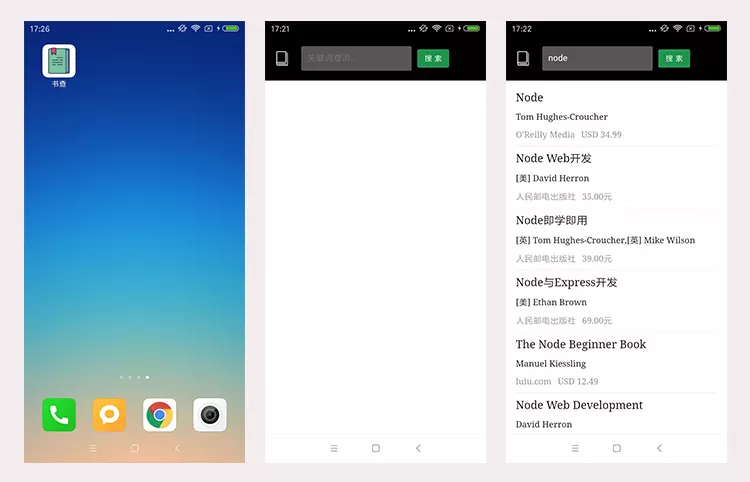

# 2）使用Manifest，让你的WebApp更“Native”


> 本文中的代码都可以在[learning-pwa的manifest分支](https://github.com/alienzhou/learning-pwa/tree/manifest)上找到（`git clone`后注意切换到manifest分支）。

### 1. 引言

我们知道，在chrome（等一些现代浏览器）中，你可以将访问的网站添加到桌面，这样就会在桌面生成一个类似“快捷方式”的图标，当你点击该图标时，便可以快速访问该网站（Web App）。我们以[第一篇文章](https://alienzhou.gitbook.io/learning-pwa/2018-kai-shi-ni-de-pwa-xue-xi-zhi-lv)中的demo为例，其添加到桌面后以及重新打开时的状态如下：


然而，对于PWA来说，有一些重要的特性：

* Web App可以被添加到桌面并有它自己的应用图标；
* 同时，从桌面开启时，会和原生app一样有它自己的“开屏图”；
* 更进一步的，这个Web App在的样子几乎和原生应用一样——没有浏览器的地址栏、工具条，似乎和Native App一样运行在一个独立的容器中。

就像下面这样：



接下来，我们会基于该系列——《PWA学习与实践》的前一篇[《2018，开始你的PWA学习之旅》](https://alienzhou.gitbook.io/learning-pwa/2018-kai-shi-ni-de-pwa-xue-xi-zhi-lv) 中所提及的一个普通Web App的demo来进行改造，来实现PWA的这一效果。或者直接从github clone learning-pwa（[https://github.com/alienzhou/learning-pwa/tree/master](https://github.com/alienzhou/learning-pwa/tree/master)）这个仓库也可以。切换到manifest分支，即可看到本文的最后成果。

### 2. Web App Manifest

Manifest是一个JSON格式的文件，你可以把它理解为一个指定了Web App桌面图标、名称、开屏图标、运行模式等一系列资源的一个清单。

> manifest 的目的是将Web应用程序安装到设备的主屏幕，为用户提供更快的访问和更丰富的体验。 —— MDN

我们来看一下，learning-pwa中的[manifest.json](https://github.com/alienzhou/learning-pwa/blob/manifest/public/manifest.json)文件内容

```javascript
{
    "name": "图书搜索",
    "short_name": "书查",
    "start_url": "/",
    "display": "standalone",
    "background_color": "#333",
    "description": "一个搜索图书的小WebAPP（基于豆瓣开放接口）",
    "orientation": "portrait-primary",
    "theme_color": "#5eace0",
    "icons": [{
        "src": "img/icons/book-32.png",
        "sizes": "32x32",
        "type": "image/png"
    }, {
        "src": "img/icons/book-72.png",
        "sizes": "72x72",
        "type": "image/png"
    }, {
        "src": "img/icons/book-128.png",
        "sizes": "128x128",
        "type": "image/png"
    }, {
        "src": "img/icons/book-144.png",
        "sizes": "144x144",
        "type": "image/png"
    }, {
        "src": "img/icons/book-192.png",
        "sizes": "192x192",
        "type": "image/png"
    }, {
        "src": "img/icons/book-256.png",
        "sizes": "256x256",
        "type": "image/png"
    }, {
        "src": "img/icons/book-512.png",
        "sizes": "512x512",
        "type": "image/png"
    }]
}
```

可以看出，上面的JSON配置文件非常直观，通过声明各个属性的值，即可改造我们的Web App。那么下面就针对每个具体值进行简单的介绍。

#### 2.1. name, short\_name

指定了Web App的名称。`short_name`其实是该应用的一个简称。一般来说，当没有足够空间展示应用的`name`时，系统就会使用`short_name`。可以看到本文的例子中，图书搜索这个应用在桌面上展示的名称就是`short_name`书查。

#### 2.2. start\_url

这个属性指定了用户打开该Web App时加载的URL。相对URL会相对于manifest。这里我们指定了`start_url`为`/`，访问根目录。

#### 2.3. display

`display`控制了应用的显示模式，它有四个值可以选择：`fullscreen`、`standalone`、`minimal-ui`和`browser`。

* `fullscreen`：全屏显示，会尽可能将所有的显示区域都占满；
* `standalone`：独立应用模式，这种模式下打开的应用有自己的启动图标，并且不会有浏览器的地址栏。因此看起来更像一个Native App；
* `minimal-ui`：与`standalone`相比，该模式会多出地址栏；
* `browser`：一般来说，会和正常使用浏览器打开样式一致。

让我们来看下这四种模式的差异：


当然，不同的系统所表现出的具体样式也不完全一样。就像示例中的虚拟按键在`fullscreen`模式下会默认隐藏。

#### 2.4. orientation

控制Web App的方向。设置某些值会具有类似锁屏的效果（禁止旋转），例如例子中的`portrait-primary`。具体的值包括：`any, natural, landscape, landscape-primary, landscape-secondary, portrait, portrait-primary, portrait-secondary`。

#### 2.5. icons， background\_color

`icons`用来指定应用的桌面图标。icons本身是一个数组，每个元素包含三个属性：

* sizes：图标的大小。通过指定大小，系统会选取最合适的图标展示在相应位置上。
* src：图标的文件路径。注意相对路径是相对于manifest。
* type：图标的图片类型。

需要指出的是，我一直提的“开屏图”其实是背景颜色+图标的展示模式（并不会设置一张所谓的开屏图）。`background_color`是在应用的样式资源为加载完毕前的默认背景，因此会展示在开屏界面。`background_color`加上我们刚才定义的`icons`就组成了Web App打开时的“开屏图”。

#### 2.6. theme\_color

定义应用程序的默认主题颜色。 这有时会影响操作系统显示应用程序的方式（例如，在Android的任务切换器上，主题颜色包围应用程序）。此外，还可以在meta标签中设置theme\_color：`<meta name="theme-color" content="#5eace0"/>`

#### 2.7. description

这个字段的含义非常简单，就是一段对该应用的描述。

### 3. 使用Manifest

创建好manifest文件后，下一步就是需要知道如何能让我们的Web App使用它——非常简单，只需要在head中添加一个link标签：

```markup
<!-- 在index.html中添加以下meta标签 -->
<link rel="manifest" href="/manifest.json">
```

这样，在android上我们使用chrome将应用添加到桌面，就会拥有文章开头处的PWA效果。你可在这里验证manifest.json的内容：[Web Manifest Validator](https://manifest-validator.appspot.com/)

如果你看到这里，那么恭喜你，已经知道如何让我们的Web App看起来更像一个独立的Native App。是不是非常简单？

### 4. iOS, Windows?

上面的一切看似美好，然而真的如此么？

到目前为止，我们的工作都非常顺利：创建manifest.json，添加meta标签，然后把我们的Web App添加到桌面。然而，如果我们在iPhone上访问我们的站点，然后“添加到主屏幕”，你会发现——一切都失效了！是的，你没有看错，一切都回到了原样。


如果你看过[caniuse](https://caniuse.com/#search=manifest)上manifest的兼容性，那会令你更加头疼。但是，也不必太过忧伤，在iOS与windows上，我们有其他的方式

### 5. iOS（safari）中的处理方式

safari虽然不支持Web App Manifest，但是它有自己的一些head标签来定义相应的资源与展示形式：

* `apple-touch-icon`：桌面图标，通过在head中添加`<link rel="apple-touch-icon" href="your_icon.png">`即可。其中还可以添加sizes属性，来指示系统使用在各类平台（iphone、ipad…）中使用最合适的图标
* `apple-mobile-web-app-title`：应用的标题。注意，这里需要使用meta标签`<meta name="apple-mobile-web-app-title" content="AppTitle">`
* `apple-mobile-web-app-capable`：类似于manifest中的display的功能，通过设置为yes可以进入standalone模式，同样也是meta标签`<meta name="apple-mobile-web-app-capable" content="yes">`
* `apple-mobile-web-app-status-bar-style`：这会改变iOS移动设备的状态栏的样式，并且只有在standalone模式中才会有效果。`<meta name="apple-mobile-web-app-status-bar-style" content="black">`，不过在iPhoneX上black会导致状态栏不显示任何东西。

下面是learning-pwa项目中的相关设置

```markup
<meta name="apple-mobile-web-app-capable" content="yes">
<meta name="apple-mobile-web-app-status-bar-style" content="default">
<meta name="apple-mobile-web-app-title" content="图书搜索">
<link rel="apple-touch-icon" href="img/icons/book-256.png">
```

### 6. IE中的处理方式

与Safari类似，IE中也有自己的meta标签来指示相应的资源。其中比较重要的有：

* `application-name`：指明了app的名称
* `msapplication-TileColor`：指明了“tile”的背景颜色
* `msapplication-xxxlogo`：不同大小的“tile”所使用的图标，包括这几种：`msapplication-square70x70logo, msapplication-square150x150logo, msapplication-wide310x150logo, msapplication-square310x310logo`

下面是learning-pwa项目中的相关设置，其中图标的设置为了方便就复用了已有的图标文件

```markup
<meta name="application-name" content="图书搜索" />
<meta name="msapplication-TileColor" content="#222">
<meta name="msapplication-square70x70logo" content="img/icons/book-72.png" />
<meta name="msapplication-square150x150logo" content="img/icons/book-144.png" />
<meta name="msapplication-square310x310logo" content="img/icons/book-256.png" />
```

### 写在最后

本文主要探索如何让被添加到桌面的Web App具有更贴近Native App的使用体验（桌面图标、开屏页、AppShell…）。

因此，我们使用了Web App Manifest。通过我们添加manifest文件，并在HTML中设置相应的meta标签来使用它即可；而在safari与ie中，可以通过一些特有的meta、link标签来实现。是不是很简单，很方便？这就使得我们能够以很低成本的改动我们Web App。这也就是PWA概念的理念之一：你可以渐进式地提高Web App的能力，同时在兼容性上，也会根据不同的浏览器的支持度提供渐进增强的能力。

好了，这篇文章的内容就到这里了。希望你能够喜欢！同时，想要了解PWA背后的更多相关技术，欢迎关注本系列后续文章。

### 参考资料

* [Web App Manifest（MDN）](https://developer.mozilla.org/zh-CN/docs/Web/Manifest)
* [Configuring Web Applications（Safari）](https://developer.apple.com/library/content/documentation/AppleApplications/Reference/SafariWebContent/ConfiguringWebApplications/ConfiguringWebApplications.html)
* [Pinned site enhancements（Internet Explorer）](https://docs.microsoft.com/en-us/previous-versions/windows/internet-explorer/ie-developer/dev-guides/bg183312%28v=vs.85%29)
* [caniuse manifest](https://caniuse.com/#search=manifest)
* [Web Manifest Validator](https://manifest-validator.appspot.com/)
* [Address Bar Matches Brand Colors](https://developers.google.com/web/tools/lighthouse/audits/address-bar)
* [demo代码地址：learning-pwa/tree/manifest](https://github.com/alienzhou/learning-pwa/tree/manifest)

